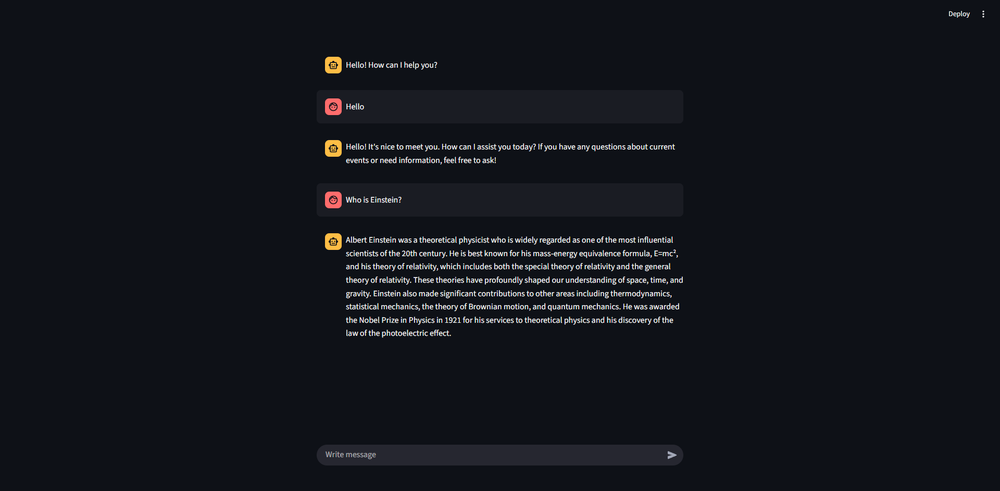

# LangGraph Tool-Enhanced Chatbot

This project is an AI assistant built using LangChain, LangGraph, and Hugging Face models. It integrates the Tavily search tool to provide users with up-to-date information and delivers a tool-augmented conversational experience. The user interface is developed with Streamlit.

## Features

- LLM powered by Hugging Face
- Web-based search capability with the Tavily Search tool
- LangGraph-based workflow infrastructure
- Streamlit-powered user interface

## Screenshots

### UI


## Installation

Clone the project and navigate to the project directory:

```bash
  git clone <repo-url>
  cd conversational-agent
```

Create a virtual environment:

```bash
  python -m venv env
  source env/bin/activate  # Mac/Linux
  env\Scripts\activate     # Windows
```

Install the dependencies:

```bash
  pip install -r requirements.txt
```

Set up environment variables:

```bash
  HUGGINGFACE_API=YOUR_HUGGINGFACE_API_KEY
  TAVILY_API_KEY=YOUR_TAVILY_API_KEY
```

Run the project:

```bash
  python main.py # (CLI)
  streamlit run ui.py # (WEB)
```

## Technologies Used

- Python
- LangChain
- LangGraph
- Hugging Face Hub	
- Tavily Search API	
- Streamlit	